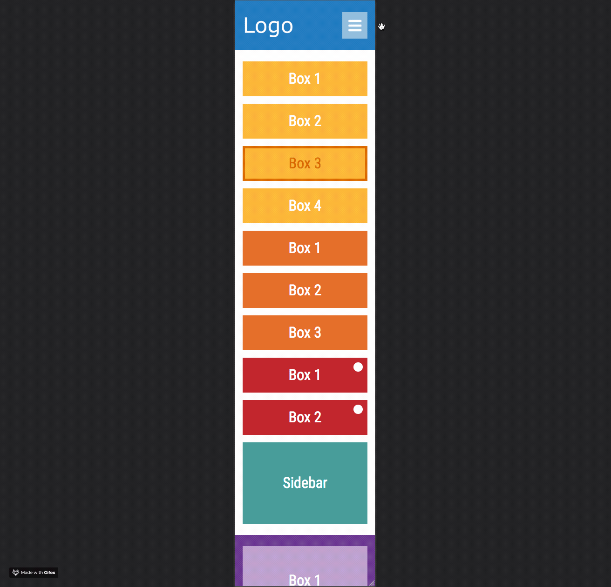

# Responsive Layout

A guideline for designing modern web pages with Flexbox and CSS Grid.



---

## Setup

1. Clone or download repository
   
    ```bash
    git clone https://github.com/ilya-zhidkov/responsive-layout.git
    ```

2. Open `index.html` file using either local or file server.

---

### Use case

- Setting up a new **vanilla HTML & CSS** project
- Emphasizing on **HTML 5 semantic tags**
- Positioning elements using **Flexbox** and **CSS Grid**
- Including **FontAwesome 5** icon library
- Improving typography with **Google Fonts** 
- Implementing **Sticky Footer**
- **Adjusting layout** for desktop, tablet as well as phone view-ports

---

*Made for students of UJEP (Univerzita Jana Evangelisty Purkyně) in Ústí nad Labem who are specializing in computer science degree.*
